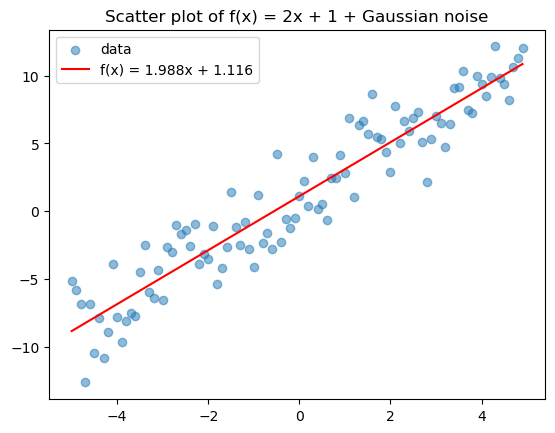
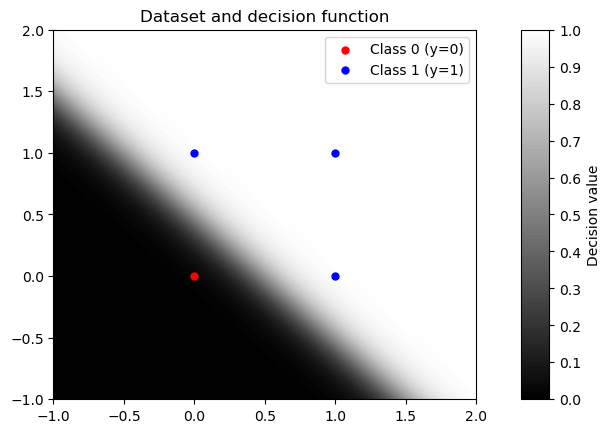
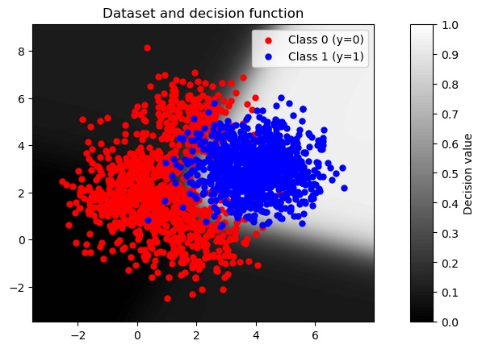
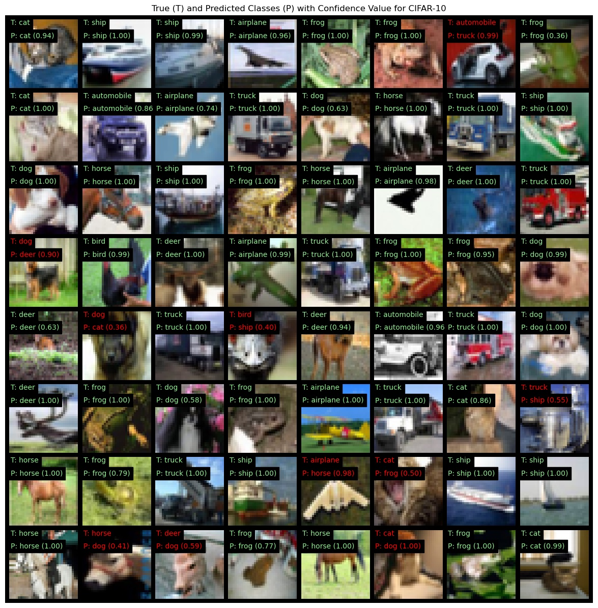
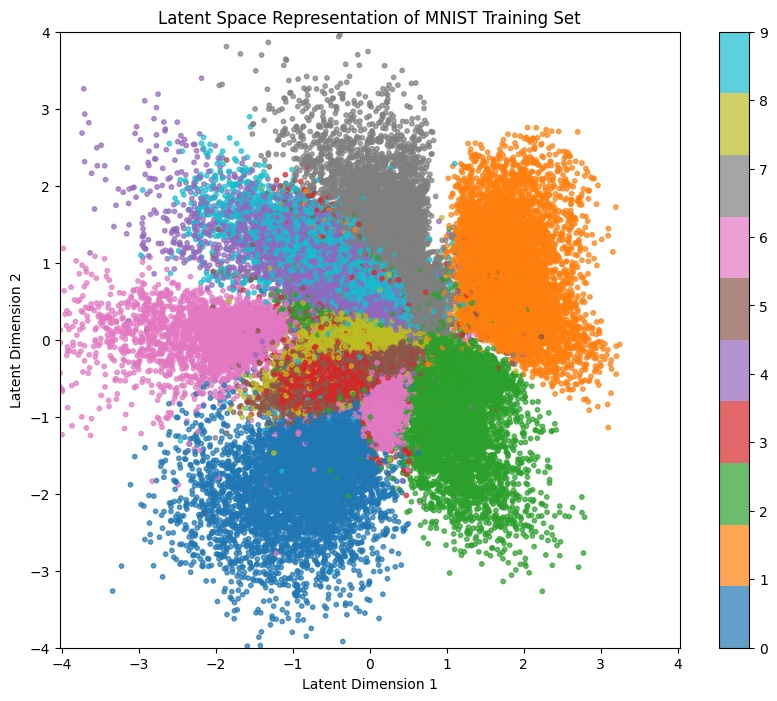
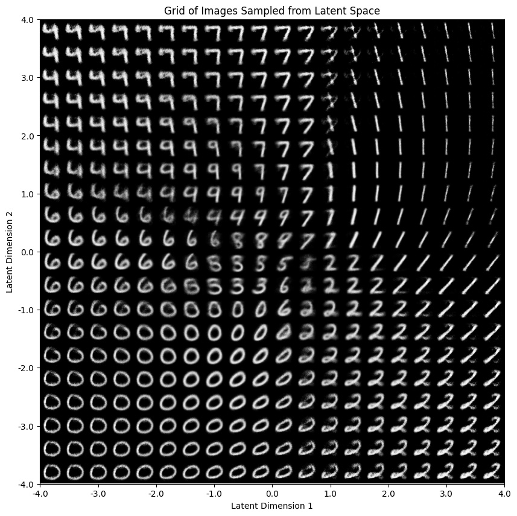
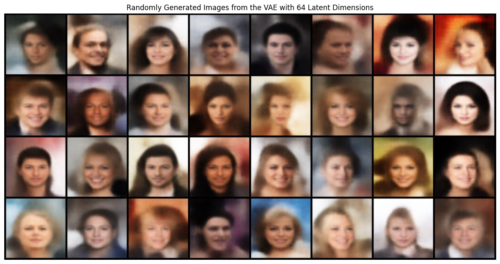
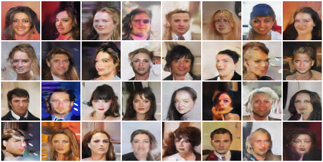
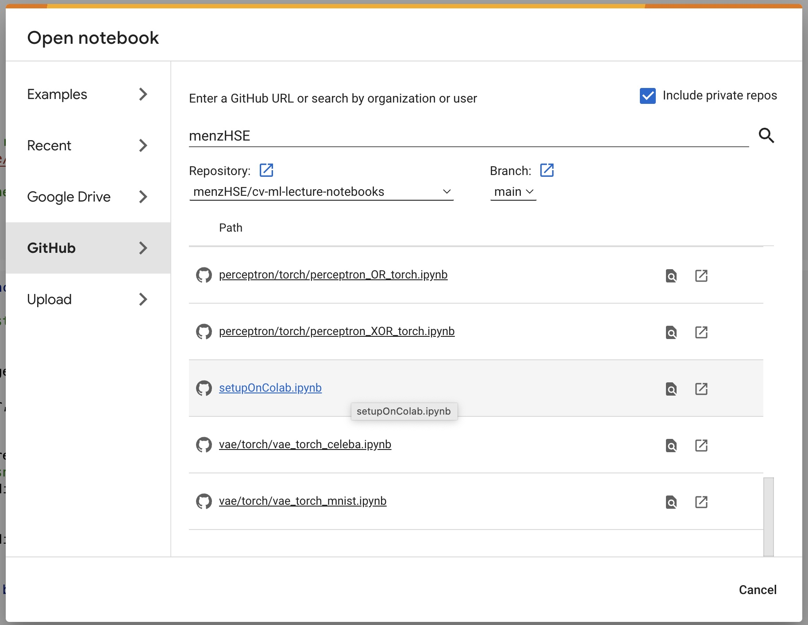
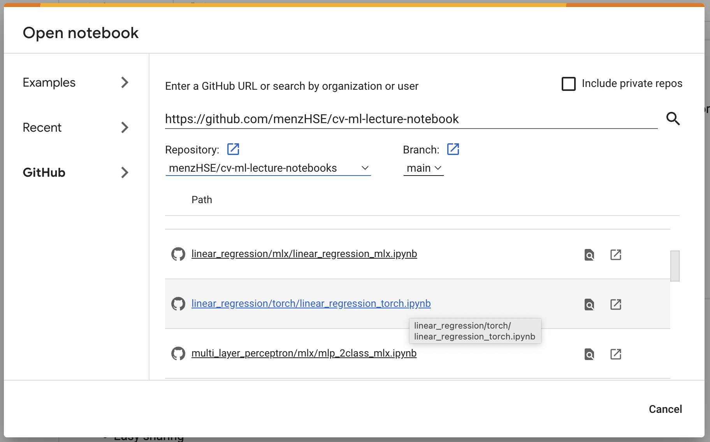

# Computer Vision and Machine Learning Jupyter Notebooks

## About

Author: [Markus Enzweiler](https://markus-enzweiler-de), markus.enzweiler@hs-esslingen.de

This repository contains Jupyter notebooks used in my lectures at Esslingen University of Applied Sciences. The notebooks mainly use PyTorch (https://pytorch.org/) and are written for educational purposes with explanations and visualizations. There are additional notebooks available for some topics that use MLX for Apple M(x) SoCs (https://github.com/ml-explore/mlx) or pure NumPy (https://numpy.org/).

## Contributing

**Feel free to use and contribute!**

I welcome contributions from the community. If you find bugs or have suggestions for additional features, please feel free to submit pull requests.

### Suggested Contributions:
- **Additional Topics**: Contributions that introduce new topics such as CNNs for object detection / semantic segmentation, diffusion models, RNNs (Recurrent Neural Networks), LSTMs (Long Short-Term Memory networks), Transformers, and other advanced neural network architectures are highly appreciated.
- **JAX Examples**: I'm particularly interested in expanding the examples to include JAX implementations.
- **Theoretical Explanations**: In-depth theoretical explanations or visualizations that enhance understanding of the presented concepts in machine learning and neural network design are welcome. Contributions that bridge the gap between theory and practical implementation would be especially valuable.


### Use of the Material:
Please cite or acknowledge this repository when using its contents for your teaching or projects. 


## Contents

To work through all of the material, the following order is recommended. 

### 1) Automatic Differentiation
* `autograd`: Demo of automatic differentiation in PyTorch and MLX.


### 2) Linear Regression
* `linear_regression`: Demo of linear regression in PyTorch and MLX.




### 3) Perceptrons
* `perceptron`: Multiple demos of perceptrons in NumPy, PyTorch and MLX. Some of the demos are very "spelled-out" to provide some insights into the inner working of gradient descent, e.g. comparison of manually derived gradients vs. automatic differentiation. There are several different variants of (the same) gradient descent implemented: "manual" gradient descent, gradient descent via autograd, gradient descent via backprop (`loss.backward()`), and gradient descent using PyTorch optimizers (`torch.optim`). 




### 4) Multi-Layer Perceptrons (MLPs)
* `multi_layer_perceptron`: Multiple demos of multi-layer perceptrons in PyTorch and MLX including visualizations of decision boundaries.




### 5) Convolutional Neural Networks (CNNs)
* `cnn`: Demos of CNNs in PyTorch and MLX for image classification. This example uses code from the repositories https://github.com/menzHSE/torch-cifar-10-cnn and https://github.com/menzHSE/mlx-cifar-10-cnn. It demonstrates defining, training and testing a small custom ResNet-like CNN from scratch as well as finetuning a larger ResNet that has been pre-trained on ImageNet to CIFAR-10 / 100. 




### 6) Convolutional Variational Autoencoders (VAEs)
* `vae`: Demos and analyses of convolutional Variational Autoencoders (VAEs) using the MNIST and Celeb-A datasets in PyTorch including: Training, reconstruction of training and test data, generation of random samples, visualization of latent spaces. This example comes with pretrained VAE models and uses code from the repository https://github.com/menzHSE/torch-vae. 



<br>

<br>



### 7) Convolutional Generative Adversarial Networks (GANs)
* `gan`: Demos and analyses of convolutional Deep Generative Adversarial Networks (DCGANs) using the MNIST and Celeb-A datasets in PyTorch including: Training, generation of random samples, visualization of latent spaces. This example comes with pretrained GAN models and uses code from the repository https://github.com/menzHSE/torch-gan. 

**MNIST**


<br>


**CelebA**


<br>


## Usage
You can run the Jupyter notebooks locally or in a cloud environment, e.g. Google Colab. There is a `requirements.txt` file in every folder that is automatically used by the notebooks to install dependencies within the active environments. 

### Google Colab
On Google Colab this repository works by interfacing with Google Drive to host the repository itself. To set this up, a notebook `setupOnColab.ipynb` is provided in the repository. This notebook mounts and clones the repository to Google Drive. **It has to be executed once in Colab.** After it has been executed, the repository is available on your Google Drive. In each Jupyter notebook, the Google Drive is then mounted to the local Colab virtual machine.

There a two different way to open and execute `setupOnColab.ipynb` in Colab. 

#### 1) Open Colab and select File -> Open Notebook. From the menu, choose GitHub and open `setupOnColab.ipynb`



#### 2) Clone this repo locally, copy `setupOnColab.ipynb` to your Google Drive and open `setupOnColab.ipynb` from there in Colab


#### Once the repository has been cloned to your Google Drive with either of the two methods, open the notebooks directly from there in Colab. Make sure to select a GPU runtime for computation-heavy notebooks!



### Local Environment

For local setups, a `conda` environment with Jupyter kernels is recommended, e.g.

```
conda create --name cv-ml-torch python=3.10
conda activate cv-ml-torch
conda install ipykernel
git clone https://github.com/menzHSE/cv-ml-lecture-notebooks
pip install -r cv-ml-lecture-notebooks/requirements_torch.txt
python -m ipykernel install --user --name=cv-ml-torch
```

There are two different requirements files, `requirements_torch.txt` for PyTorch environments and `requirements_mlx.txt` for Apple MLX environments, that can be installed via `pip`. On an Apple silicon machine, both can be installed in the same environment. 

After installation of all dependencies and the custom Jupyter kernel you can open notebooks in your favorite tool (e.g. VSCode) and select the installed Jupyter kernel `cv-ml-torch` to execute the notebooks. 
